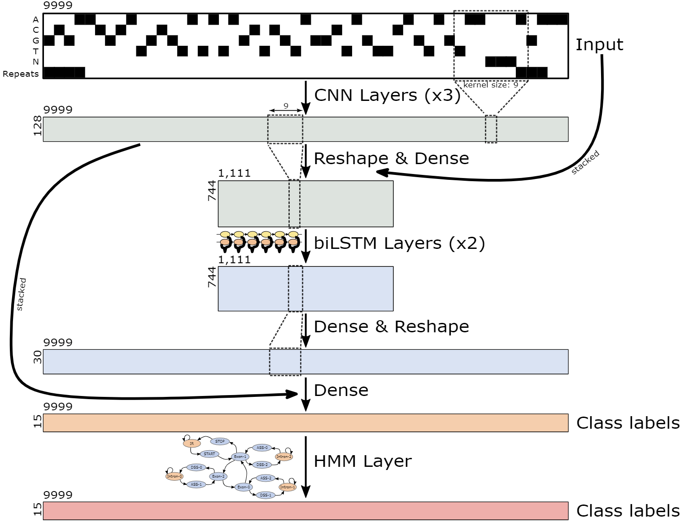
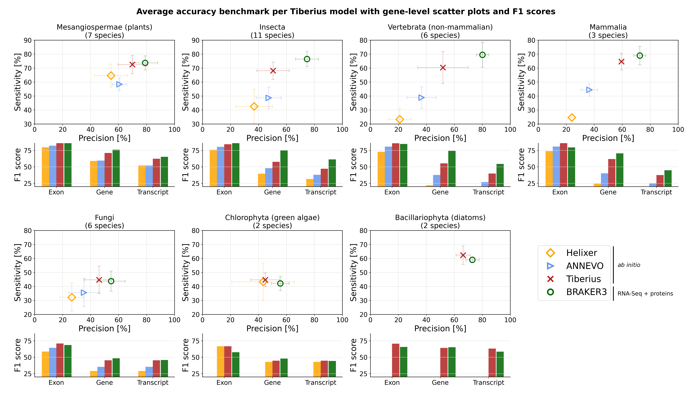

# Tiberius: End-to-End Deep Learning with an HMM for Gene Prediction

Tiberius is a deep learning-based *ab initio* gene structure prediction tool that end-to-end integrates convolutional
and long short-term memory layers with a differentiable HMM layer. It can be used to predict gene structures from **genomic sequences only**, while matching the accuracy of tool that use extrinsic evidence.

Currently, we provide only model weights for mammalian species and Tiberius does not predict alternative splicing variants. 

## Installation

### Git Repositories

Clone the repository, including learnMSA as submodule:
```
git clone --recursive https://github.com/Gaius-Augustus/Tiberius
```
In case you cloned the repository without the submodule, you can load the submodule with:
```
git submodule update --init --recursive
```
Alternatively, you can clone the learnMSA repository separately:
```shell
git clone https://github.com/Gaius-Augustus/learnMSA
cd learnMSA
git checkout parallel
```
Ensure that learnMSA was loaded and that is on the branch `parallel`.

### Python Libraries

The following Python libraries are required:
- tensorflow==2.10.*
- tensorflow_probability==0.18.0
- transformers (optional)
- pyBigWig
- biopython 
- bcbio-gff
- requests

They can be installed with:
```
pip install tensorflow_probability==0.18.0 transformers pyBigWig bio scikit-learn biopython bcbio-gff requests
```
Tensorflow should be installed with GPU support. If you are using conda, you can install it with these [instructions](docs/install_tensorflow.md).

Alternatively, you can install Tesorflow using pip:
```shell
pip install tensorflow-gpu==2.10.*
```

If you want to use GPUs, verify that TensorFlow is installed correctly with GPU support:
```shell
python3 -c "import tensorflow as tf; print(tf.config.list_physical_devices('GPU'))"
```


## Running Tiberius for Gene Prediction

To run Tiberius with `bin/tiberius.py`, you need to provide a FASTA file containing the genomic sequences. The sequence can either include repeat softmasking (recommended) or be run without softmasking. See [softmasking_workflow](docs/softmasking_workflow.md) for recommandations on how to mask repeats for Tiberius. Currently, we only provide weights for mammalian species, they will be downloaded automatically.

### Running Tiberius with softmasked genome
If you want to run Tiberius with softmasking, model weights will be downloaded from https://bioinf.uni-greifswald.de/bioinf/tiberius/models/tiberius_weights.tgz into `model_weights`.

```shell
# Run Tiberius with softmasking
python bin/tiberius.py --fasta input.fasta --out output.gtf
```

You can also manually download the weights and provide the path to the weights with the `--model` argument.
```shell
wget https://bioinf.uni-greifswald.de/bioinf/tiberius/models/tiberius_weights.tgz
tar -xzvf tiberius_weights.tgz
python bin/tiberius.py --fasta input.fasta --out output.gtf --model path/to/tiberius_weights
```

### Running Tiberius without softmasked genome
If you want to run Tiberius without softmasking, you can use the `--no_softmasking` argument. Tiberius will download the weights for the non-softmasking model automatically from https://bioinf.uni-greifswald.de/bioinf/tiberius/models/tiberius_nosm_weights.tgz into `model_weights`.
```shell
# Run Tiberius without softmasking
python bin/tiberius.py --fasta input.fasta --out output.gtf --no_softmasking
```

You can also manually download the weights and provide the path to the weights with the `--model` argument. Note that in this case you have to provide the weights with `--model_lstm` to Tiberius.

```shell
wget https://bioinf.uni-greifswald.de/bioinf/tiberius/models/tiberius_nosm_weights.tgz
tar -xzvf tiberius_nosm_weights.tgz
python bin/tiberius.py --fasta input.fasta --out output.gtf --model_lstm path/to/tiberius_nosm_weights
```

### Running Tiberius with evolutionary information
To run Tiberius in *de novo* mode, evolutionary information data has to be generated with ClaMSA. See [docs/clamsa_data.md](docs/clamsa_data.md) for instructions on how to generate the data. Afterwards, you should have a directory with files named `$clamsa/{prefix}{seq_name}.npz` for each sequence of your FASTA file. You can then run Tiberius with the `--clamsa` argument. Note that your genome has to be softmasked for this mode and that you have to use different training weights than in *ab initio* mode. If not provided, they will automatically downloaded from https://bioinf.uni-greifswald.de/bioinf/tiberius/models/tiberius_denovo_weights.tgz into `model_weights`.
```shell
# Run Tiberius with softmasking
python bin/tiberius.py --fasta input.fasta --clamsa $clamsa/{prefix} --out output.gtf
```
You can also manually download the weights and provide the path to the weights with the `--model` argument. 

```shell
wget https://bioinf.uni-greifswald.de/bioinf/tiberius/models/tiberius_denovo_weights.tgz
tar -xzvf tiberius_denovo_weights.tgz
python bin/tiberius.py --fasta input.fasta --out output.gtf --model_lstm path/to/tiberius_denovo_weights
```


Tiberius produces a GTF file containing the predicted gene structures. It can also generate FASTA-formatted files of coding sequences and protein sequences when locations are specified using the `--codingseq` and `--protseq` options, respectively.

If you want to write custom code for Tiberius gene prediction, see [example_prediction.ipynb](test_data/Panthera_pardus/example_prediction.ipynb) for an example on how to write a custom prediction script.

## Training Tiberius
Currently, we provide only model weights for mammalian species. If you want to train Tiberius on your own data, you need at least a genomic seqeunce file (FASTA) and reference annotations (GTF) for each species. There two ways to do it:
1. Training Tiberius with a large dataset that does not fit into memory. See [training_large_data.md](docs/training_large_data.md) for documentation on how to prepare a dataset and train Tiberius with it.
2. Training Tiberius with a small dataset that fits into memory. See [example_train_full.ipynb](test_data/Panthera_pardus/example_train_full.ipynb) for an example on how to load data and train Tiberius on a single genome. This can easily be adapted to train Tiberius on several genomes by first loading the data for all genome and then training the model. See [training_large_data.md](docs/training_large_data-md) (Step 1) and [softmasking_workflow.md](docs/softmasking_workflow.md) for the preparation of the genome and annotation files.

## Tiberius Model and Accuracies

Tiberius' model consists of a model that consist of CNN, biLSTM, and a differentiable HMM layer. 
  


The model was trained end-to-end on 32 mammalian genomes and it reaches state-of-the-art prediction accuracies for mammalian genomes, matching the accuracy of extrinsic evidence based gene prediction tools.




## Example Annotations from Tiberius
We provide example annotations for *Homo sapiens* (genome assembly GCF_000001405.40), *Bos taurus* (genome assembly GCF_000003205.7) and *Delphinapterus leucas* (genome assembly GCF_002288925.1) that were generated with Tiberius using the default weights:
```shell
wget https://bioinf.uni-greifswald.de/bioinf/tiberius/anno/Homo_sapiens.gtf.gz
wget https://bioinf.uni-greifswald.de/bioinf/tiberius/anno/Bos_taurus.gtf.gz
wget https://bioinf.uni-greifswald.de/bioinf/tiberius/anno/Delphinapterus_leucas.gtf.gz
```