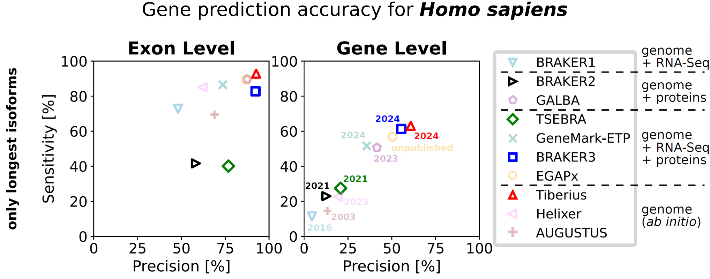
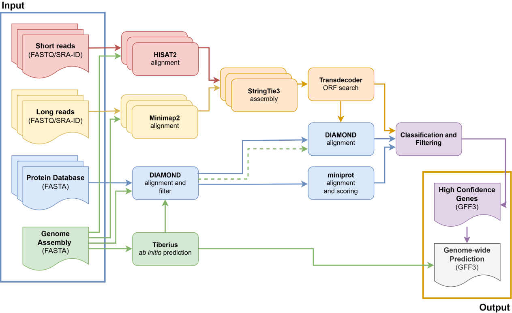

### ⚠️ Important Update — February 2026
#### Tiberius models for many new clades are now available!

# Tiberius: End-to-End Deep Learning with an HMM for Gene Prediction

For more information, see the [Tiberius paper](https://academic.oup.com/bioinformatics/article/40/12/btae685/7903281).


Tiberius is a deep learning-based *ab initio* gene structure prediction tool that end-to-end integrates convolutional
and long short-term memory layers with a differentiable HMM layer. It can be used to predict gene structures from **genomic sequences only** (*ab initio*), while matching the accuracy of tool that use extrinsic evidence.

Additionally, Tiberius provides an evidence mode that generates highly precise gene structures from extrinsic evidence, which are then combined with Tiberius *ab initio* predictions. Tiberius can also be parallelized on HPC systems using Nextflow.





## Table of Contents

- [Quick Start](#quick-start)
- [Prerequisites](#prerequisites)
- [Installation](#installation)
- [Running Tiberius](#running-tiberius)
  - [Choosing the Model Weights](#choosing-the-model-weights)
  - [Ab Initio Gene Prediction](#ab-initio-gene-prediction)
  - [Running Tiberius with Nextflow](#running-tiberius-with-nextflow)
  - [Running Tiberius with Extrinsic Evidence](#running-tiberius-with-extrinsic-evidence-nextflow-only)
  - [Running Tiberius with evolutionary information](#running-tiberius-with-evolutionary-information)
  - [Running Tiberius on Different GPUs](#running-tiberius-on-different-gpus)
- [Training Tiberius](#training-tiberius)
- [Tiberius Model](#tiberius-model)
- [Annotations from Tiberius](#annotations-from-tiberius)
- [Troubleshooting](#troubleshooting)
- [How to Cite](#how-to-cite)
- [References](#references)

We are providing pre-trained models for the following clades (see [model_cfg/README.md](model_cfg/README.md) for details):

- **Animals:** Mammalia, Vertebrates, Insecta
- **Plants:** Eudicotyledons, Monocotyledonae
- **Fungi:** Fungi, Fungi incertae sedis, Mucoromycota, Saccharomycota, Sordariomycota, Basidiomycota
- **Algae & Protists:** Diatoms, Chlorophyta


## Quick Start

```shell
# 1. Clone and install the Tiberius launcher
git clone https://github.com/Gaius-Augustus/Tiberius
cd Tiberius
pip install .

# 2. See which pre-trained models are available
python tiberius.py --list_cfg

# 3. Run gene prediction (using Singularity – recommended)
python tiberius.py --singularity --genome genome.fasta \
    --model_cfg mammalia_softmasking_v2 --out tiberius.gtf

# Or without Singularity (requires local dependencies, see Installation below)
python tiberius.py --genome genome.fasta \
    --model_cfg mammalia_softmasking_v2 --out tiberius.gtf
```

Tiberius outputs a **GTF file** with predicted gene structures. You can additionally obtain coding and protein sequences with `--codingseq` and `--protseq`.


## Prerequisites

- **Python >= 3.9**
- **GPU** with at least 8 GB memory recommended (see [recommended batch sizes](#running-tiberius-on-different-gpus)); Tiberius can also run on CPU, but will be significantly slower
- **Singularity** (recommended) — or a local installation of all dependencies (TensorFlow with GPU support, etc.)
- **Nextflow** (only required for HPC parallelization or the evidence pipeline)

## Installation

This repository must always be cloned locally, as Tiberius relies on a local launcher script that manages execution and that can pull the Singularity image.
```
git clone https://github.com/Gaius-Augustus/Tiberius
cd Tiberius
pip install .
```

The command above installs the Tiberius Python package itself and is **required in all cases**, including when running Tiberius via Singularity.

Tiberius can be executed either using Singularity, Docker, or with a local installation with all dependencies.

### Option A: Using Singularity (recommended)

No additional installation steps are needed. The `pip install .` above is sufficient. On the first run, pass `--singularity` and Tiberius will automatically download the Singularity image:

```
python tiberius.py --singularity --genome input.fasta --model_cfg mammalia_softmasking_v2 --out tiberius.gtf
```

### Option B: Using Docker

If you have root access (or are in the `docker` group), you can use the Docker image directly. The image includes TensorFlow 2.10 with GPU support and all external tools needed for the evidence pipeline.

```shell
# Pull the image
docker pull larsgabriel23/tiberius:latest

# Run Tiberius (with GPU access)
docker run --gpus all -v $(pwd):/data larsgabriel23/tiberius:latest \
    python /opt/Tiberius/tiberius.py --genome /data/genome.fasta \
    --model_cfg mammalia_softmasking_v2 --out /data/tiberius.gtf
```

Note that `--gpus all` requires the [NVIDIA Container Toolkit](https://docs.nvidia.com/datacenter/cloud-native/container-toolkit/install-guide.html). Omit it to run on CPU.

### Option C: Installation from Source

If Singularity is **not** used, Tiberius must be installed together with its dependencies as defined in the `from_source` dependencies in pyproject.toml:
```
pip install .[from_source]
```

**Note:**
If TensorFlow is *not* installed beforehand, `pip install .[from_source]` installs the latest available TensorFlow version. This version may restrict the usable `--seq_len` to **≤ 259 992**, which can slightly reduce prediction accuracy.

If you want to use a longer sequence length, install **TensorFlow 2.10** manually by following the [instructions](docs/install_tensorflow.md) or use the Singularity container.

#### Python Libraries

The following Python libraries are required and installed with `pip install .[from_source]`:

- tensorflow[and-cuda] (<2.18)
- numpy
- biopython
- pyBigWig
- bcbio-gff
- requests
- rich
- pyyaml

Make sure TensorFlow is installed with GPU support. Tiberius was built on TensorFlow 2.10 and runs best with that version. If you are using conda, you can install Tensorflow 2.10 with these [instructions](docs/install_tensorflow.md).

Tiberius does also work with TensorFlow >2.10, however, **it will produce a warning if `--seq_len` exceeds 259,992 during inference.** Since the default `--seq_len` is 500,004, this warning will appear on every run with TensorFlow >2.10 unless you explicitly set `--seq_len 259992`. This can slightly reduce prediction accuracy.


## Running Tiberius

Tiberius supports several execution modes. The table below gives a quick overview — details for each mode follow in the sections below.

| Mode | What it does | Key arguments |
| ---- | ------------ | ------------- |
| **Ab initio** | Gene prediction from genomic sequence only | `--genome`, `--model_cfg` |
| **Nextflow** | Parallelized *ab initio* prediction across multiple GPUs on an HPC | `--nf_config`, `--genome`, `--model_cfg` |
| **Evidence pipeline** (Nextflow) | Combines *ab initio* predictions with extrinsic evidence (proteins, RNA-Seq, Iso-Seq) | `--nf_config`, `--params_yaml` |
| **De novo with ClaMSA** | Uses evolutionary information from ClaMSA as additional input | `--genome`, `--clamsa`, `--model_cfg` |

All modes are invoked through `tiberius.py`. Add `--singularity` to any direct (non-Nextflow) command to run inside the Singularity container.

### Choosing the Model Weights

Tiberius requires a model config file (`--model_cfg`). The model config is a YAML file that contains the model weights URL and other information about the model. See [model_cfg](model_cfg/README.md) for available configurations and how to create custom ones. You can pass either a full path or a short name (e.g., `diatoms` or `diatoms.yaml`).

To list all available model configs and their target species:

```shell
python tiberius.py --list_cfg
```

To inspect the details of a specific model config:

```shell
python tiberius.py --show_cfg --model_cfg diatoms
```

**Softmasking:** Each model config specifies whether it uses the softmasking track as an input feature. For several clades, both variants are available (e.g., `insecta` for softmasked genomes and `insecta_unmasked` for unmasked genomes). An unmasked model can be applied to a softmasked genome without issues — the masking is simply ignored. However, applying a softmasked model to an unmasked genome will degrade prediction accuracy, since the model expects masking information that is not present.

**We generally recommend using unmasked models** as the safer default. Softmasked models can be fragile: if the target genome was masked differently than the training data (e.g., different repeat library or masking tool), accuracy may degrade. Softmasking can provide a small benefit when predicting for species that are distant from the training species, as shown in the original paper for mammalian parameters. See [softmasking_workflow](docs/softmasking_workflow.md) for how to mask repeats and [model_cfg](model_cfg/README.md) for which models require softmasking.

**Using local weight files:** Instead of a model config, you can pass a local `.h5` weight file directly with `--model`. In this case softmasking is **enabled by default**. If your weights were trained without softmasking, you **must** pass `--no_softmasking` explicitly:

```shell
# Local weights trained without softmasking
python tiberius.py --genome genome.fasta --model weights.h5 --no_softmasking --out tiberius.gtf
```

### *Ab Initio* Gene Prediction

To run Tiberius with `tiberius.py`, you need to provide a FASTA file containing the genomic sequences and a model config file (or a local weight file, see above).

Tiberius can be run using **Singularity** for example for a mammalian species with softmasking with the following command:
```shell
# Run Tiberius for a softmasked mammalian genome
python tiberius.py --singularity --genome input.fasta \
    --out output.gtf --model_cfg mammalia_softmasking_v2.yaml
```

In order to run Tiberius with a local installation omit `--singularity`.

Tiberius produces a GTF file containing the predicted gene structures (default: `tiberius.gtf`). It can also generate FASTA-formatted files of coding sequences and protein sequences when locations are specified using the `--codingseq` and `--protseq` options, respectively.


### Running Tiberius with Nextflow

Tiberius can also be parallelized across multiple GPU nodes on an HPC with Nextflow. For this, you have to set up a nextflow configuration for your specific cluster and extend [conf/base.config](conf/base.config). As an example, see [conf/slurm_generic.config](conf/slurm_generic.config) and see section *Adapting Tiberius to an HPC* in [conf/README.md](conf/README.md).

You can start Tiberius with Nextflow by providing it with your Nextflow config file:
```shell
# Nextflow for a Diatom genome
python tiberius.py --nf_config conf/slurm_generic.config --genome input.fasta --model_cfg diatoms
```


### Running Tiberius with Extrinsic Evidence (Nextflow-only)

You can also run the Tiberius Evidence Pipeline. A set of high confidence genes is generated and added to the Tiberius prediction that improves its accuracy, it adds some alternative splicing forms and it includes UTR regions for the evidence-only predictions.

To provide Tiberius with the files and required parameters, it is recommended to generate a parameter file `params.yaml`. See [conf/README.md](conf/README.md) for details about the parameter file and [conf/parameters.yaml](conf/parameters.yaml) for a template.


```shell
# Evidence pipeline with an existing params file
python tiberius.py --params_yaml params.yaml --nf_config conf/slurm_generic.config
```

Parameters in the params.yaml file can be overwritten with command line arguments

```shell
# Nextflow with params file and commandline overwrites
python tiberius.py --nf_config conf/base.config --genome input.fasta --model_cfg diatoms --outdir results
```



### Running Tiberius with evolutionary information
To run Tiberius in *de novo* mode, evolutionary information data has to be generated with ClaMSA. See [docs/clamsa_data.md](docs/clamsa_data.md) for instructions on how to generate the data. Afterwards, you should have a directory with files named `$clamsa/{prefix}{seq_name}.npz` for each sequence of your FASTA file. You can then run Tiberius with the `--clamsa` argument. Note that your genome has to be softmasked for this mode and that you have to use different training weights than in *ab initio* mode. You can download the model weights from [https://bioinf.uni-greifswald.de/bioinf/tiberius/models/tiberius_denovo_weights_v2.tar.gz](https://bioinf.uni-greifswald.de/bioinf/tiberius/models/tiberius_denovo_weights_v2.tar.gz). Or you can provide Tiberius with the model configuration file `model_cfg/mammalia_clamsa_v2.yaml`
```shell
# Run Tiberius with softmasking
python tiberius.py --genome input.fasta --clamsa $clamsa/{prefix} --out output.gtf --model_cfg mammalia_clamsa_v2.yaml
```

### Running Tiberius on Different GPUs

Tiberius can run on any GPU with at least 8GB of memory. However, you will need to adjust the batch size to match the memory capacity of your GPU using the `--batch_size` argument. Below is a list of recommended batch sizes for different GPUs:
Here is a list of GPUs to batch sizes:
- **A100 (80GB):** batch size of 16
- **RTX 3090 (25GB):** batch size of 8
- **RTX 2070 (8GB):** batch size of 2


## Training Tiberius
We recommend using one of the provided trained models. However, if you want to train Tiberius on your own data, you need at least a genomic sequence file (FASTA) and reference annotations (GTF) for each species. **Note that you can only train on genes with one transcript isoform per gene.** Please remove alternative splicing variants before training. There two ways to train Tiberius:
1. Training Tiberius with a large dataset that does not fit into memory. See [training_large_data.md](docs/training_large_data.md) for documentation on how to prepare a dataset and train Tiberius with it.
2. Training Tiberius with a small dataset that fits into memory. See [example_train_full.ipynb](test_data/Panthera_pardus/example_train_full.ipynb) for an example on how to load data and train Tiberius on a single genome. This can easily be adapted to train Tiberius on several genomes by first loading the data for all genome and then training the model. See [training_large_data.md](docs/training_large_data.md) (Step 1) and [softmasking_workflow.md](docs/softmasking_workflow.md) for the preparation of the genome and annotation files.

## Tiberius Model

Tiberius' model consists of CNN, biLSTM, and a differentiable HMM layer.


## Annotations from Tiberius

 [Tiberius predictions for 1314 mammalian assemblies](https://bioinf.uni-greifswald.de/bioinf/tiberius/genes/tib-tbl.html)

We also provide example annotations for *Homo sapiens* (genome assembly GCF_000001405.40), *Bos taurus* (genome assembly GCF_000003205.7) and *Delphinapterus leucas* (genome assembly GCF_002288925.1) that were generated at the time of writing the paper with Tiberius using the default weights:
```shell
wget https://bioinf.uni-greifswald.de/bioinf/tiberius/anno/Homo_sapiens.gtf.gz
wget https://bioinf.uni-greifswald.de/bioinf/tiberius/anno/Bos_taurus.gtf.gz
wget https://bioinf.uni-greifswald.de/bioinf/tiberius/anno/Delphinapterus_leucas.gtf.gz
```
[Human genome annotation](https://genome.ucsc.edu/s/MaSta/Tiberius_hg38) track on UCSC Genome Browser.


## Troubleshooting

**GPU out of memory:**
Reduce `--batch_size`. See [Running Tiberius on Different GPUs](#running-tiberius-on-different-gpus) for recommended values per GPU.

**TensorFlow does not detect the GPU:**
Make sure TensorFlow is installed with GPU support and that compatible CUDA/cuDNN drivers are available. Using the Singularity container (`--singularity`) avoids most driver issues. You can verify GPU visibility with:
```shell
python -c "import tensorflow as tf; print(tf.config.list_physical_devices('GPU'))"
```

**`--seq_len` warning with TensorFlow > 2.10:**
TensorFlow versions newer than 2.10 restrict `--seq_len` to 259,992. This can slightly reduce accuracy. To use longer sequences, install TensorFlow 2.10 (see [instructions](docs/install_tensorflow.md)) or use the Singularity container.

**`PackageNotFoundError: No package metadata was found for tiberius`:**
Install the package from the repository root:
```shell
pip install .
# or, for development:
pip install -e .
```

## How to Cite

If you use Tiberius in your research, please cite:

> Lars Gabriel, Felix Becker, Katharina J Hoff, Mario Stanke, Tiberius: end-to-end deep learning with an HMM for gene prediction, *Bioinformatics*, Volume 40, Issue 12, December 2024, btae685, [https://doi.org/10.1093/bioinformatics/btae685](https://doi.org/10.1093/bioinformatics/btae685)

<details>
<summary>BibTeX</summary>

```bibtex
@article{gabriel2024tiberius,
    author  = {Gabriel, Lars and Becker, Felix and Hoff, Katharina J and Stanke, Mario},
    title   = {Tiberius: end-to-end deep learning with an {HMM} for gene prediction},
    journal = {Bioinformatics},
    volume  = {40},
    number  = {12},
    pages   = {btae685},
    year    = {2024},
    month   = {12},
    doi     = {10.1093/bioinformatics/btae685},
}
```

</details>

## References

  - Gabriel, Lars, et al. "Tiberius: End-to-End Deep Learning with an HMM for Gene Prediction." 2024, [*Bioinformatics*](https://academic.oup.com/bioinformatics/article/40/12/btae685/7903281), [bioRxiv](https://www.biorxiv.org/content/early/2024/07/23/2024.07.21.604459)
  - [Popular science podcast on this paper generated with NotebookLM](https://bioinf.uni-greifswald.de/bioinf/tiberius/pod/Tiberius.wav)
  - Processed RefSeq annotations used for training, validation and evaluation as described in the paper.
`wget https://bioinf.uni-greifswald.de/bioinf/tiberius/anno/ref_annot.tar.gz`
