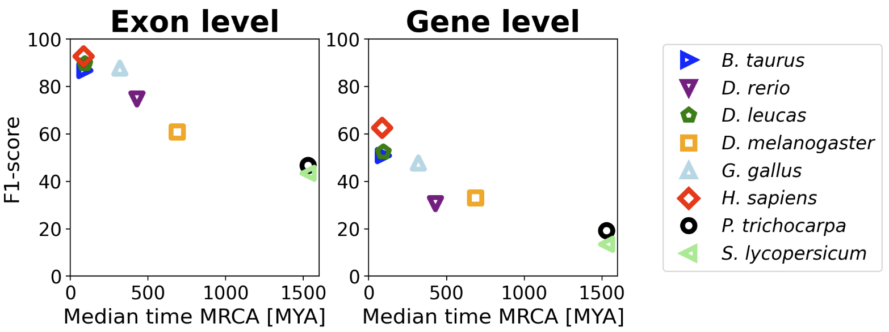

 

# Tiberius: End-to-End Deep Learning with an HMM for Gene Prediction

For more information, see the [Tiberius paper](https://academic.oup.com/bioinformatics/article/40/12/btae685/7903281).


Tiberius is a deep learning-based *ab initio* gene structure prediction tool that end-to-end integrates convolutional
and long short-term memory layers with a differentiable HMM layer. It can be used to predict gene structures from **genomic sequences only**, while matching the accuracy of tool that use extrinsic evidence.


Currently, we provide only model weights for mammalian species and Tiberius does not predict alternative splicing variants. 


## Installation

Tiberius can either be installed from source or can be run with a **Singularity** container

### Installation with Singularity container
Build Singularity container with:
```
singularity build tiberius.sif docker://larsgabriel23/tiberius:latest
```

Run Tiberius with the Singularity container (use `-nv` for GPU support):
```
 singularity run --cleanenv --env PYTHONNOUSERSITE=1 --nv tiberius.sif tiberius.py [options]
```

### Installation from Source

Install Tiberius and its dependencies:
```
git clone https://github.com/Gaius-Augustus/Tiberius
cd Tiberius
pip install .
```

**Note:**  
If TensorFlow is *not* installed beforehand, `pip install .` installs the latest available TensorFlow version. This version may restrict the usable `--seq_len` to **≤ 259 992**, which can slightly reduce prediction accuracy.

If you want to use a longer sequence length, install **TensorFlow 2.10** manually by following the [instructions](docs/install_tensorflow.md) or use the Singularity container.

#### Python Libraries

The following Python libraries are required and installed with Tiberius:
- tensorflow
- pyBigWig
- biopython 
- bcbio-gff
- requests
- gzip
- bz2

Make sure TensorFlow is installed with GPU support. Tiberius was built on TensorFlow 2.10 and runs best with that version. If you are using conda, you can install Tensorflow 2.10 with these [instructions](docs/install_tensorflow.md).

Tiberius does also work with TensorFlow >2.10, however, **it will produce an error if you use a `--seq_len` parameter > 259.992 during inference!**  

## Running Tiberius for Gene Prediction

To run Tiberius with `tiberius.py`, you need to provide a FASTA file containing the genomic sequences. The sequence can either include repeat softmasking (recommended) or be run without softmasking. See [softmasking_workflow](docs/softmasking_workflow.md) for recommandations on how to mask repeats for Tiberius. Currently, we only provide weights for mammalian species, they can be downloaded automatically by Tiberius if no model_cfg is provided.

### Choosing the model weights

There are three ways in providing the model weights to Tiberius:
1. **Automatic download**: Tiberius will automatically download the model weights from the Tiberius server if you do note provide model weights.
2. **Model config**: You can provide a model config file with the `--model_cfg` argument. The model config file is a YAML file that contains the model weights URL and other information about the model. See [model_cfg](model_cfg/README.md) for more information on how to create a model config file and available model configurations.
3. **Local model weights**: You can provide the path to the model weights with the `--model` argument. 

### Running Tiberius with softmasked genome
If you want to run Tiberius with softmasking, model weights will be downloaded from https://bioinf.uni-greifswald.de/bioinf/tiberius/models/tiberius_weights.tgz into `model_weights`.

```shell
# Run Tiberius with softmasking
python tiberius.py --genome input.fasta --out output.gtf 
```

Or you can specify the model configuration file with:
```shell
# Run Tiberius with softmasking
python tiberius.py --genome input.fasta --out output.gtf --model_cfg model_cfg/mammalia_softmasking_v2.yaml
```

You can also manually download the weights and provide the path to the weights with the `--model` argument.
```shell
wget https://bioinf.uni-greifswald.de/bioinf/tiberius/models/tiberius_weights_v2.tar.gz
python tiberius.py --genome input.fasta --out output.gtf --model tiberius_weights_v2.tar.gz
```

### Running Tiberius without softmasked genome
If you want to run Tiberius without softmasking, you can use the `--no_softmasking` argument. Tiberius will download the weights for the non-softmasking model automatically from https://bioinf.uni-greifswald.de/bioinf/tiberius/models/tiberius_nosm_weights.tgz into `model_weights`. Or you can provide Tiberius with the model configuration file `model_cfg/mammalia_nosofttmasking_v2.yaml`
```shell
# Run Tiberius without softmasking
python tiberius.py --genome input.fasta --out output.gtf --no_softmasking
```

### Running Tiberius with evolutionary information
To run Tiberius in *de novo* mode, evolutionary information data has to be generated with ClaMSA. See [docs/clamsa_data.md](docs/clamsa_data.md) for instructions on how to generate the data. Afterwards, you should have a directory with files named `$clamsa/{prefix}{seq_name}.npz` for each sequence of your FASTA file. You can then run Tiberius with the `--clamsa` argument. Note that your genome has to be softmasked for this mode and that you have to use different training weights than in *ab initio* mode. If not provided, they will automatically downloaded from https://bioinf.uni-greifswald.de/bioinf/tiberius/models/tiberius_denovo_weights.tgz into `model_weights`. Or you can provide Tiberius with the model configuration file `model_cfg/mammalia_clamsa_v2.yaml`
```shell
# Run Tiberius with softmasking
python tiberius.py --genome input.fasta --clamsa $clamsa/{prefix} --out output.gtf
```

### Running Tiberius on Differnet GPUs

Tiberius can run on any GPU with at least 8GB of memory. However, you will need to adjust the batch size to match the memory capacity of your GPU using the `--batch_size` argument. Below is a list of recommended batch sizes for different GPUs:
Here is a list of GPUs to batch siezes:
- **A100 (80GB):** batch size of 16
- **RTX 3090 (25GB):** batch size of 8
- **RTX 2070 (8GB):** batch size of 2


Tiberius produces a GTF file containing the predicted gene structures. It can also generate FASTA-formatted files of coding sequences and protein sequences when locations are specified using the `--codingseq` and `--protseq` options, respectively.

If you want to write custom code for Tiberius gene prediction, see [example_prediction.ipynb](test_data/Panthera_pardus/example_prediction.ipynb) for an example on how to write a custom prediction script.

## Training Tiberius
Currently, we provide only model weights for mammalian species. If you want to train Tiberius on your own data, you need at least a genomic seqeunce file (FASTA) and reference annotations (GTF) for each species. **Note that you can only train on genes with one transcript isoform per gene.** Please remove alternative splicing variants before training. There two ways to train Tiberius:
1. Training Tiberius with a large dataset that does not fit into memory. See [training_large_data.md](docs/training_large_data.md) for documentation on how to prepare a dataset and train Tiberius with it.
2. Training Tiberius with a small dataset that fits into memory. See [example_train_full.ipynb](test_data/Panthera_pardus/example_train_full.ipynb) for an example on how to load data and train Tiberius on a single genome. This can easily be adapted to train Tiberius on several genomes by first loading the data for all genome and then training the model. See [training_large_data.md](docs/training_large_data-md) (Step 1) and [softmasking_workflow.md](docs/softmasking_workflow.md) for the preparation of the genome and annotation files.

## Tiberius Model and Accuracies on non Mammalian species

Tiberius' model consists of a model that consist of CNN, biLSTM, and a differentiable HMM layer. 
  


The model was trained end-to-end on 32 mammalian genomes and it reaches state-of-the-art prediction accuracies for mammalian genomes, matching the accuracy of extrinsic evidence based gene prediction tools.




## Annotations from Tiberius

 [Tiberius predictions for 1314 mamalian assemblies](https://bioinf.uni-greifswald.de/bioinf/tiberius/genes/tib-tbl.html)
 
We also provide example annotations for *Homo sapiens* (genome assembly GCF_000001405.40), *Bos taurus* (genome assembly GCF_000003205.7) and *Delphinapterus leucas* (genome assembly GCF_002288925.1) that were generated at the time of writing the paper with Tiberius using the default weights:
```shell
wget https://bioinf.uni-greifswald.de/bioinf/tiberius/anno/Homo_sapiens.gtf.gz
wget https://bioinf.uni-greifswald.de/bioinf/tiberius/anno/Bos_taurus.gtf.gz
wget https://bioinf.uni-greifswald.de/bioinf/tiberius/anno/Delphinapterus_leucas.gtf.gz
```
[Human genome annotation](https://genome.ucsc.edu/s/MaSta/Tiberius_hg38) track on UCSC Genome Browser.


## References
  - Gabriel, Lars, et al. "Tiberius: End-to-End Deep Learning with an HMM for Gene Prediction." 2024, [*Bioinformatics*](https://academic.oup.com/bioinformatics/article/40/12/btae685/7903281), [bioRxiv](https://www.biorxiv.org/content/early/2024/07/23/2024.07.21.604459)
  - [Popular science podcast on this paper generated with NotebookLM](https://bioinf.uni-greifswald.de/bioinf/tiberius/pod/Tiberius.wav)
  - Processed RefSeq annotations used for training, validation and evaluation as described in the paper.  
`wget https://bioinf.uni-greifswald.de/bioinf/tiberius/anno/ref_annot.tar.gz`
